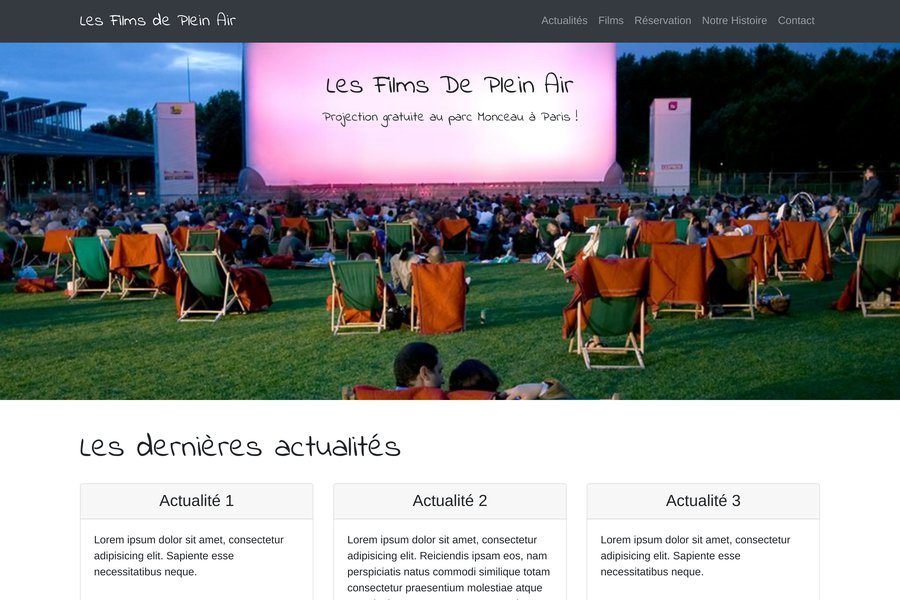

# Les Films de Plein Air 🎬🌿

Projet de maquette web réalisé dans le cadre d'un exercice d'intégration **HTML / CSS / JavaScript**.  
Ce site présente l'événement fictif **"Les Films de Plein Air au Parc Monceau à Paris"** et intègre une navigation fluide, un catalogue de films, une section actualités et un formulaire de réservation.

---



---

## 📂 Fonctionnalités

- **Maquette responsive** basée sur Bootstrap.
- **Navigation fluide** avec effet de défilement (`scrolling-nav.js`).
- **Section Actualités** et **programmation des films**.
- **Formulaire de réservation** avec multiple sélection de séances.
- **Structure HTML5 sémantique** et utilisation de Google Fonts.
- **Déploiement rapide** avec `Docker` ou simple ouverture du fichier `index.html`.

---

## 🚀 Déploiement

### 1. Méthode locale (sans Docker)

**Prérequis** : Navigateur web moderne.

```bash
git clone https://github.com/alexandrecorroy/lesfilmsdepleinair.git
cd lesfilmsdepleinair
Ouvrez le fichier index.html dans votre navigateur.
```

### 2. Méthode avec Docker Compose

**Prérequis** : Docker | Docker Compose

```bash
git clone https://github.com/alexandrecorroy/lesfilmsdepleinair.git
cd lesfilmsdepleinair
docker-compose up -d
```

Le site sera disponible sur : http://localhost

###  📦 Docker

**Dockerfile** :

````bash
Basé sur nginx:1.29-alpine

Copie du site dans /usr/share/nginx/html

Expose le port 80

docker-compose.yml :

Lance un service nginx

Image utilisée : yorkknew/lesfilmsdepleinair:1.0

Port mappé : 80:80
````

### 📄 Licence
Ce projet est proposé à titre d’exemple pour l’intégration web.
Aucune exploitation commerciale n’est autorisée sans accord préalable.

### ✨ Auteur
Développé par Alexandre Corroy dans le cadre d'un projet de création de maquette web.
